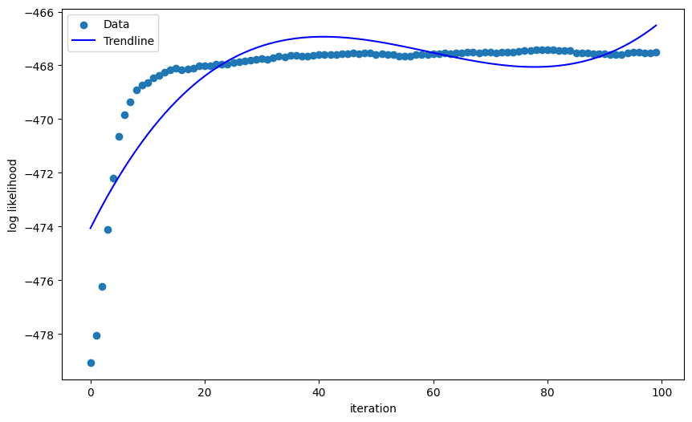
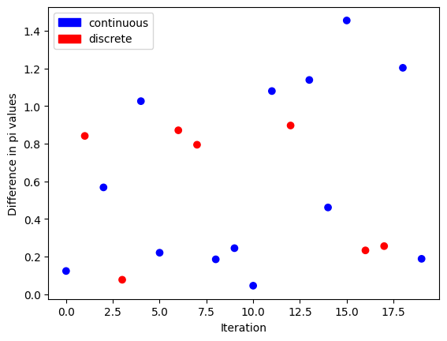

# Expectation Maximization: Responsibility Method vs. MCMC Approximation

- [Preview](#preview)
- [Intro](#intro)
- [Methods](#methods)
- [Implementation](#implementation)
- [Analysis](#analysis)
- [Conclusion](#conclusion)

# Preview

  

# Intro

Expectation Maximization (EM) is an algorithm designed for finding the mixture components of a dataset.  
A *mixed dataset* means that data points can come from different probability distributions.

For EM to work, I need to know:

1. **How many distributions** are associated with the data.
2. **What those distributions are**.

## Example
Suppose I have a dataset \( H \) that is mixed with:
- **Normal**
- **Exponential**
- **Uniform**  

I would need to know that:
- There are 3 distributions
- The distributions are Normal, Exponential, and Uniform.

## Algorithm Steps

1. **Initialization**  
   - Set each mixture component weight \( \pi_j \) for distribution \( j \) to a value in $$[0, 1]$$  
   - Ensure that all mixture weights sum to 1 (a probability distribution over distributions)  
   - Set initial parameters for each distribution.

2. **Repeat until convergence or iteration limit reached**:
   - **E-step**:  
     Use the data points, mixture weights, and PDFs of each distribution to compute the probabilities that a point came from each distribution.
   - **M-step**:  
     Update the mixture weights by averaging the probabilities for each distribution across all points.

3. **Check for convergence** or stop when maximum iterations are reached.

## Strategies

There are two main EM strategies:

### 1. Standard EM (Responsibility Method)

Responsibilities (\( \gamma_{ij} \)) are the probabilities that data point \( x_i \) came from distribution \( j \):

$$
\gamma_{ij} = P(z_i = j \mid x_i, \theta) =
\frac{\pi_j \cdot f_j(x_i)}{\sum_k \pi_k \cdot f_k(x_i)}
$$

**M-step update**:

$$
\pi_j = \frac{1}{n} \sum_{i=1}^n \gamma_{ij}
$$

Intuitively, if a data point has a high probability of belonging to a certain distribution,  
that distribution’s weight increases.

### 2. EM with Monte Carlo (EM-MC)

This method approximates responsibilities when they are expensive to compute directly.  

Steps:

1. For each data point, run a Monte Carlo Markov Chain (MCMC) for a fixed number of iterations.
2. Use the **acceptance ratio** to decide whether to move to a new distribution:

$$
\alpha = \min\left( 1, \frac{\pi_{\text{new}} \cdot f_{\text{new}}(x)}{\pi_{z} \cdot f_{z}(x)} \right)
$$

3. After sampling, estimate \( \pi_j \) as:

$$
\pi_j = \frac{\text{# samples assigned to distribution } j}{\text{total # of samples}}
$$

## Goal
- Implement both methods.
- Compare results on datasets with known mixtures.
- Analyze trade-offs in terms of accuracy and computational cost.

# Methods

To analyze these two EM methods, I first implemented them in Python and tested them with small, custom mixed datasets.  
These datasets were generated so that the **true parameters**—including mixing weights, distribution types, and parameters—were known in advance.  
This allowed direct comparison between the actual values and the results produced by each method.

Later, I extended the experiments by creating a **random mixing distribution sampler**:
- Randomly selects between **2 to 8 distributions**.
- Chooses parameters for each distribution from a fixed random range.
- Generates datasets based on the selected distributions and weights.

The experiments involved:
1. Implementing **both Standard EM** and **Monte Carlo EM**.
2. Running them on known datasets to evaluate accuracy.
3. Running them on random datasets to assess consistency and performance.

# Implementation

I first implemented the MCMC method. 

## Implementation Details (MCMC Version)

This version is **user input-based** — I specify:
- The number of mixture components
- The type of each distribution
- The initial parameters

#### **`e_step_MCMC`**
- Iterates over each data point.
- Computes the probability weight for the current \( z \) (distribution assignment) by multiplying the mixture weight with the PDF value for that point.
- Runs for a set number of MCMC steps:
  1. Picks a random \( z_{\text{new}} \) (new distribution).
  2. Computes the acceptance ratio \( \alpha \).
  3. Decides whether to transition to \( z_{\text{new}} \) based on \( \alpha \).
- Stores each transition in a chain for that data point.

#### **`m_step_MCMC`**
- Flattens the chains into one list of sampled assignments.
- Counts how many samples are assigned to each distribution.
- Updates mixture weights as:

$$
\pi_j = \frac{\text{count of samples in distribution } j}{\text{total samples}}
$$

- Includes a **`min_weight`** threshold of **0.05**:
  - Prevents any distribution’s weight from dropping to zero.
  - Avoids cases where a distribution becomes permanently inaccessible.
  - Stabilizes updates and prevents collapse.
 
I also implemented a graph that looked at the convergence in the MLE:

This was done for both methods.

## Implementation Details (Standard Version)

#### **`e_step`**
- Generates a list of **responsibilities**:
  - Each **row** represents a data point.
  - Each **column** corresponds to a distribution.
- Each entry \(\gamma_{ij}\) is the probability that data point \(i\) belongs to distribution \(j\).

#### **`m_step`**
- Updates mixture weights \(\pi_j\) by taking the **average responsibility** across all data points:

$$
\pi_j = \frac{1}{n} \sum_{i=1}^n \gamma_{ij}
$$

- Updates the parameters of each distribution.
- Calls **`update_pdfs`** to refresh the probability density functions with the updated parameters.
  - This step was **not** included in the MCMC EM implementation.

# Analysis

## Example Dataset Analysis

I tested both methods on a dataset with a **known mixture**:
- **40% Normal**
- **30% Uniform**
- **30% Exponential**

### Normal EM – Final Parameters
- **Component 1: Normal**
  - Parameters: `1.8423191947752293`, `0.5628494357388811`
  - Weight: `0.4654666666534534`
- **Component 2: Uniform**
  - Parameters: `2.001249637992631`, `4.939563309234937`
  - Weight: `0.20136666667986333`
- **Component 3: Exponential**
  - Parameters: `1.2616382356757725`
  - Weight: `0.3331666666666833`

### EM-MCMC – Final Parameters
- **Component 1: Normal**
  - Parameters: `1.8460064463447392`, `0.5583405533495043`
  - Weight: `0.46846666665315334`
- **Component 2: Uniform**
  - Parameters: `2.001249637992631`, `4.939563309234937`
  - Weight: `0.20186666667981334`
- **Component 3: Exponential**
  - Parameters: `1.2533636181134291`
  - Weight: `0.3296666666670333`

### Observations
- Both methods produced **very similar** results.
- Neither method recovered the parameters exactly — which is expected due to sampling variability and initialization choices.
- The slight differences in weights and parameters are within reasonable tolerance.

To further my investigation, I created a mixing function which allowed me to create random mixes of different distributions. This code allowed for no user input and purely off computer randomness.

I repeated the generation of random mixes of different distributions for 20 times and then analyzed the differences in mixing weights that the 2 different methods found. This gave me a plot:

 

The graph shows the absolute differences in my finished mixing weights for each mixing I randomly selected.
I see that the differences are quite random — the graph doesn’t serve much meaning, only as a look into what is happening under the hood.

The code changed each of the EM and EMMC implementations from user-based input to computer-based, in which the inputs are randomly selected for each mix. I also made a new function called `give_data_with_distribs` (both continuous and discrete cases). This randomly selects the number of mixes, what each distribution is (depending on if it’s a continuous function or a discrete one), and creates the data for my random selection.

The implementation uses the fact that I know what distributions are being generated. It also utilizes the random function for multiple decisions — whether I go discrete or not, the number of mixes I’m doing for a sample, etc.

# Conclusion

From my analysis of the two EM approaches:

- **Monte Carlo EM**  
  Requires more computation and has higher complexity than standard EM, especially evident during implementation.

- **Performance Comparison**  
  Both EM-MC and standard EM often produce similar mixture weights, but the difference can vary between datasets without a clear pattern.  
  Visual inspection suggests discrete datasets (e.g., Bernoulli, Poisson) may exhibit slightly greater divergence in mixture weights.

**Takeaway:**  
While Monte Carlo EM can be more computationally demanding and occasionally riskier, it is still a valid alternative when standard EM is not feasible.
